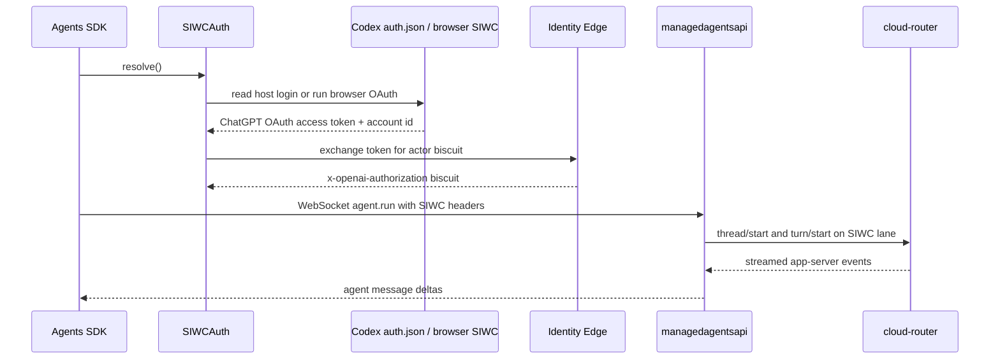
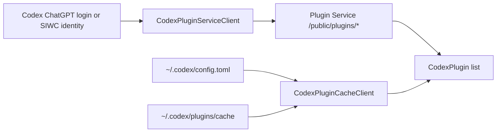

# Managed Agents SIWC and Codex Plugins

This directory contains an initial Agents SDK integration for running agents through
`managedagentsapi` with Sign in with ChatGPT (SIWC), plus a plugin inventory demo that
lists Codex plugins available to the signed-in ChatGPT identity.

The work is intentionally split into two layers:

1. SIWC identity resolution and managed agent execution.
2. Codex plugin discovery, which can later feed plugin declarations into managed agent runs.

It does not yet load or invoke Codex plugin tools inside `ManagedRunner.run(...)`. The current
plugin support is inventory only: "what plugins does this signed-in identity have?"

## What Was Added

The public SDK surface is exported from `agents`:

```python
from agents import (
    ChatGPTSIWCInteractiveProvider,
    CodexHostSIWCProvider,
    CodexPlugin,
    CodexPluginCacheClient,
    CodexPluginServiceClient,
    LocalSIWCInteractiveProvider,
    ManagedDynamicTool,
    ManagedRunner,
    ManagedRunResult,
    SIWCAuth,
    SIWCIdentity,
    format_codex_plugins,
)
```

The implementation lives in `src/agents/managed.py`.

### SIWC auth

`SIWCAuth` is the user-facing resolver used by `ManagedRunner.run(...)`.

```python
auth = SIWCAuth.from_host()
```

Supported modes:

- `SIWCAuth.from_host()`: resolves identity from the embedding host or an existing Codex
  ChatGPT login. This is the expected default for Codex-hosted flows.
- `SIWCAuth.interactive()`: opens the real browser SIWC OAuth flow by default, then mints an
  Identity Edge biscuit for managed agent execution.
- `SIWCAuth.auto(interactive=True)`: tries host identity first, then falls back to interactive
  browser sign-in.

`SIWCIdentity` carries:

- `identity_edge_biscuit`: sent to `managedagentsapi` as `x-openai-authorization`.
- `chatgpt_account_id`: sent to `managedagentsapi` as `chatgpt-account-id`.
- `access_token`: optional ChatGPT OAuth access token used only by plugin listing paths.
  It is hidden from `repr(...)`.

### Managed runner

`ManagedRunner.run(...)` sends an Agents SDK `Agent` to `managedagentsapi` over WebSocket.
It resolves SIWC identity before connecting and includes the SIWC headers in the WebSocket
handshake.

```python
from agents import Agent, ManagedRunner, SIWCAuth

agent = Agent(
    name="Managed SIWC demo",
    model="gpt-5.5",
    instructions="Answer through the managed runtime.",
)

result = await ManagedRunner.run(
    agent,
    "Say hello from managedagentsapi.",
    auth=SIWCAuth.from_host(),
    endpoint="ws://127.0.0.1:8080/v1/agents/runs",
    cwd="/tmp",
)

print(result.final_output)
```

`ManagedRunner.run(...)` is intentionally small. It currently supports:

- static string instructions
- model names as strings
- string input or normalized input item dictionaries
- optional working directory
- optional `ManagedDynamicTool` declarations
- streamed `item/agentMessage/delta` accumulation into `ManagedRunResult.final_output`

### Dynamic tool declarations

`ManagedDynamicTool` models the plugin-style dynamic tool declaration shape passed to
`managedagentsapi`.

```python
from agents import ManagedDynamicTool

tool = ManagedDynamicTool(
    namespace="demo",
    name="lookup_profile",
    description="Look up a user profile.",
    input_schema={
        "type": "object",
        "properties": {"account_id": {"type": "string"}},
        "required": ["account_id"],
    },
    defer_loading=True,
)
```

This only declares tool metadata. It does not yet bind a real Codex plugin implementation.

### Plugin inventory

There are two plugin inventory clients:

- `CodexPluginServiceClient`: calls Plugin Service public inventory endpoints using the
  ChatGPT OAuth access token from Codex auth or from a `SIWCIdentity`.
- `CodexPluginCacheClient`: reads the local Codex config and plugin package cache. This works
  without a running Plugin Service proxy and is useful for local demos.

Both return normalized `CodexPlugin` records:

```python
from agents import CodexPluginCacheClient, format_codex_plugins

plugins = CodexPluginCacheClient().list_plugins()
print(format_codex_plugins(plugins))
```

Example output:

```text
Codex plugins (3)
- GitHub (github@openai-curated) [codex-local-config] installed=true enabled=true scope=openai-curated status=enabled creator=OpenAI
- Slack (slack@openai-curated) [codex-local-config] installed=true enabled=true scope=openai-curated status=enabled creator=OpenAI
- Agents SDK (agents-sdk@openai-monorepo) [codex-local-config] installed=true enabled=true scope=openai-monorepo status=enabled creator=OpenAI
```

## End-to-End Flow



Plugin listing uses the same ChatGPT identity, but it is a separate read path:



## Demo: Managed SIWC Run

The managed run demo is:

```bash
uv run --frozen python examples/managed/siwc_managedagentsapi_demo.py --help
```

For local verification, the demo can start a fake cloud-router upstream and run real
`managedagentsapi` against it:

```bash
uv run --frozen python examples/managed/siwc_managedagentsapi_demo.py \
  --interactive-ui \
  --auto-complete-ui \
  --no-open-browser
```

That local mode verifies the SDK-to-managedagentsapi protocol and SIWC header propagation
without requiring the real cloud-router.

For real SIWC providers:

```bash
uv run --frozen python examples/managed/siwc_managedagentsapi_demo.py \
  --real-siwc \
  --case from_host_real
```

`from_host_real` reads the existing Codex ChatGPT login and exchanges it for an Identity
Edge biscuit.

## Demo: List Codex Plugins

The plugin inventory demo is:

```bash
uv run --frozen python examples/managed/list_codex_plugins.py
```

By default, the script uses `--source auto`:

- If `OPENAI_CODEX_PLUGIN_SERVICE_URL` or `--plugin-service-url` is set, it tries Plugin
  Service first.
- If Plugin Service is not reachable, it falls back to the local Codex config/cache.
- If no Plugin Service URL is set, it directly uses the local Codex config/cache.

This means the following command still works even when port `3001` is not listening:

```bash
OPENAI_CODEX_PLUGIN_SERVICE_URL=http://127.0.0.1:3001 \
uv run --frozen python examples/managed/list_codex_plugins.py
```

Expected behavior when no Plugin Service proxy is running:

```text
warning: Plugin Service request failed: <urlopen error [Errno 61] Connection refused>. Start or port-forward Plugin Service, or use the local Codex plugin cache.; falling back to the local Codex plugin cache.
Codex plugins (...)
- ...
```

Use strict Plugin Service mode when you want failures to surface instead of falling back:

```bash
uv run --frozen python examples/managed/list_codex_plugins.py \
  --source service \
  --plugin-service-url http://127.0.0.1:3001
```

Use explicit local mode when you want no network call:

```bash
uv run --frozen python examples/managed/list_codex_plugins.py --source local
```

Print JSON:

```bash
uv run --frozen python examples/managed/list_codex_plugins.py --source local --json
```

Run real browser SIWC first, then list through Plugin Service:

```bash
uv run --frozen python examples/managed/list_codex_plugins.py \
  --source service \
  --plugin-service-url http://127.0.0.1:3001 \
  --interactive-siwc \
  --identity-edge-env staging
```

## Environment Variables

SIWC:

- `OPENAI_SIWC_AUTHORIZATION`: explicit Identity Edge biscuit for host mode.
- `OPENAI_CHATGPT_ACCOUNT_ID`: ChatGPT account id paired with the explicit biscuit.
- `OPENAI_SIWC_CLIENT_ID`: OAuth client override for interactive SIWC.
- `OPENAI_SIWC_ISSUER`: AuthAPI issuer override for interactive SIWC.
- `OPENAI_SIWC_CODEX_AUTH_PATH`: Codex auth file override.
- `OPENAI_SIWC_IDENTITY_EDGE_ENV`: Identity Edge environment, for example `prod` or
  `staging`.
- `OPENAI_SIWC_IDENTITY_EDGE_URL`: explicit Identity Edge base URL override.

Codex auth/config:

- `CODEX_AUTH_PATH`: Codex auth file override.
- `CODEX_HOME`: root used for `auth.json`, `config.toml`, and `plugins/cache`.
- `OPENAI_CODEX_CONFIG_PATH`: Codex `config.toml` override for local plugin listing.
- `OPENAI_CODEX_PLUGIN_CACHE_DIR`: Codex plugin cache override for local plugin listing.

Plugin Service:

- `OPENAI_CODEX_PLUGIN_SERVICE_URL`: base URL for Plugin Service public inventory
  endpoints.

## Important Limits

This is an initial integration. It does not yet:

- invoke Codex plugin tools from `ManagedRunner.run(...)`
- translate `CodexPlugin` records into executable managed agent tool bindings
- call the Codex app-server `plugin/list` RPC from Agents SDK
- expose real host UI chrome beyond browser OAuth and the local demo provider
- implement token refresh for Plugin Service calls

The local cache fallback is deliberately a demo and diagnostics path. It answers "which
plugins are enabled in this local Codex install?" It does not prove that Plugin Service would
authorize every same plugin for a remote managed agent run.

## Troubleshooting

### `Connection refused` for `127.0.0.1:3001`

Nothing is listening on that port. Either start or port-forward Plugin Service, or use:

```bash
uv run --frozen python examples/managed/list_codex_plugins.py --source local
```

The default `--source auto` mode now falls back to local cache for this case.

### `Codex plugin listing requires a ChatGPT OAuth access token`

The Plugin Service client found an API key, session token, or no token where it expected a
ChatGPT OAuth access token. Use local cache mode for local inventory, or sign in with ChatGPT
through Codex/SIWC before calling Plugin Service.

### `SIWC host identity is unavailable`

`SIWCAuth.from_host()` could not find explicit SIWC headers or a usable Codex ChatGPT login.
Use `SIWCAuth.auto(interactive=True)`, run the interactive demo, or sign in to ChatGPT in Codex.

## Verification

The focused verification for this work is:

```bash
PYTHONDONTWRITEBYTECODE=1 uv run --frozen pytest tests/test_managed_siwc.py -q
PYTHONDONTWRITEBYTECODE=1 uv run --frozen ruff check src/agents/managed.py src/agents/__init__.py tests/test_managed_siwc.py examples/managed/list_codex_plugins.py examples/managed/siwc_managedagentsapi_demo.py
PYTHONDONTWRITEBYTECODE=1 uv run --frozen ruff format --check src/agents/managed.py src/agents/__init__.py tests/test_managed_siwc.py examples/managed/list_codex_plugins.py examples/managed/siwc_managedagentsapi_demo.py
PYTHONDONTWRITEBYTECODE=1 uv run --frozen pyright src/agents/managed.py tests/test_managed_siwc.py examples/managed/list_codex_plugins.py
git diff --check
```
